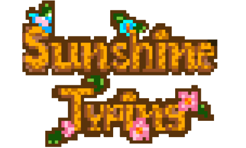

<p align="center">
    <a href="https://github.com/FITM-KMUTNB">
        <picture>
            
        </picture>
        <h1 align="center">✨ Sunshine Typing by Component Team</h1>
    </a>
</p>

## ✏️ Who we are?

We are students of King Mongkut's University of Technology North Bangkok working together on a group project on a computer programming class.

## 📣 What is the project about?

Typing test project, which requires python to create, which the instructor suggested using pygame for this project.

## 📦 What are the libraries in the project?

- pygame (latest) -> no specific version
- pygame_gui (latest) -> no specific version

These libraries are managed with **pipenv** to make them easier to run in different environments and our project is using python version **3.9**

## ⚗️ How to open the program?

First of all, you need to contact pipenv to manage the environment, where you can see how to install it [here](https://pypi.org/project/pipenv/).

After installation you need to go into the source code folder first after typing the command.

```
pipenv shell
pipenv install
```

After typing the above two commands, you can run the game with commands via script.

**If you're running macOS or Linux**

```
chmod +x ./run.sh
./run.sh
```

**If you're running Windows**

```
You can click on **run.bat** to open the program.
```

## 🔨 Authors

- Yongyuth Chuankhuntod **(Python Developer & Lead Team)**
- Sukonlawat Choolert **(Graphic Designer)**
- Pornthawan Khumphai **(Graphic Designer)**
- Pawat Narkjuathong **(Composer)**
- Chanakan Toursupap **(Composer)**
- Jirapong Chanthaleka **(Composer)**
